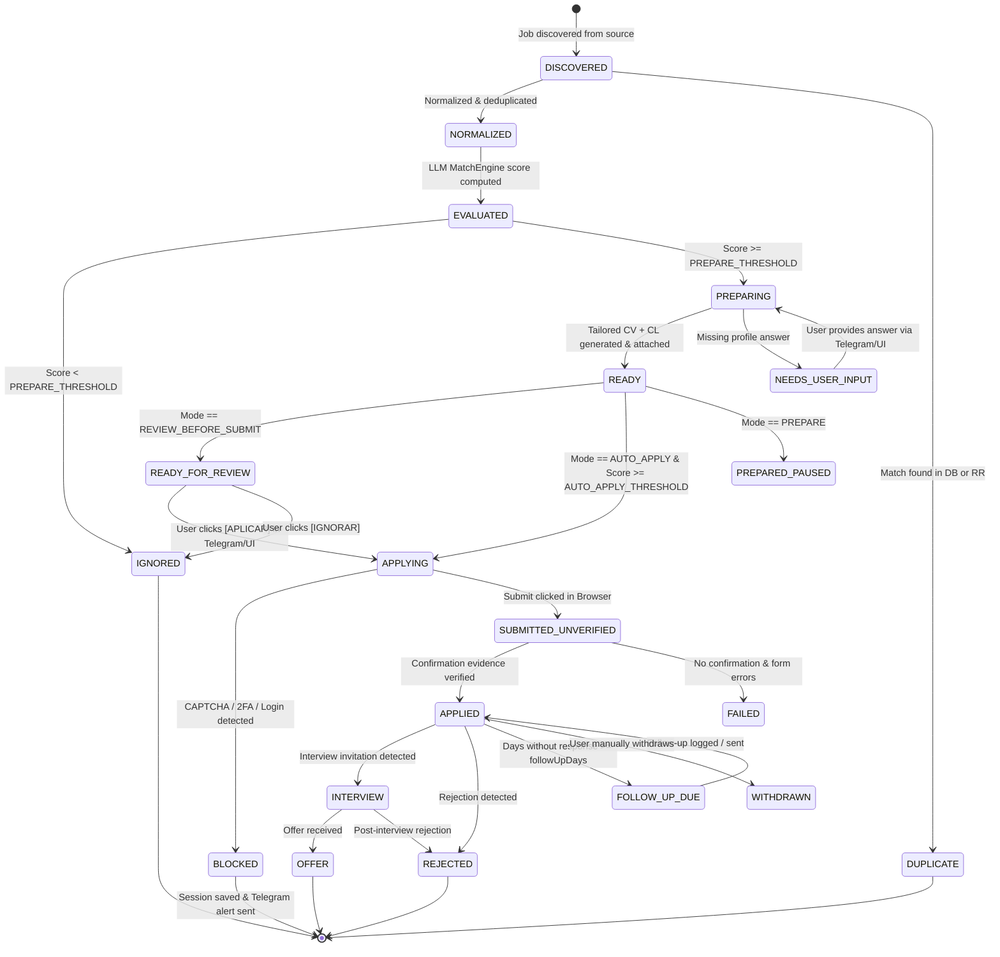

# Application State Machine Specification

## 1. State Machine Overview

The Job Agent state machine manages the complete lifecycle of a job opportunity, from discovery through evaluation, preparation, automated submission, verification, and post-submission monitoring.



---

## 2. State Definitions

| State | Category | Description |
|---|---|---|
| `DISCOVERED` | Transient | Raw job listing ingested from feed/API before deduplication. |
| `NORMALIZED` | Persistent | Cleaned, canonical job record with parsed salary, location, and tags. |
| `DUPLICATE` | Terminal | Job matches an existing canonical job or an existing Reactive Resume application. |
| `EVALUATED` | Persistent | LLM evaluation complete with 0–100 score and structured criteria. |
| `IGNORED` | Terminal | Job score below threshold or explicit user exclusion. |
| `PREPARING` | Active | Reactive Resume Application created; deriving CV, generating tailored bullets and cover letter. |
| `NEEDS_USER_INPUT` | Waiting | Form or job requires private personal data not present in `CandidateProfile` or `CandidateAnswerVault`. |
| `READY` | Milestone | Tailored CV and Cover Letter created, PDF exported and attached to Reactive Resume. Form ready for entry. |
| `READY_FOR_REVIEW` | Waiting | Form completed up to final submit; awaiting user authorization via Telegram inline button or web UI. |
| `APPLYING` | Active | Playwright browser executing form fill and file uploads. |
| `SUBMITTED_UNVERIFIED` | Critical Window | Submit button clicked; awaiting DOM transition or confirmation redirect. |
| `APPLIED` | Persistent | Confirmation evidence verified; Reactive Resume stage updated to `applied`. |
| `BLOCKED` | Suspended | CAPTCHA, 2FA, or login required. Execution safely halted without bypass attempts. |
| `FAILED` | Terminal / Retry | Network failure, timeout, or submission error. Eligible for retry based on error classification. |
| `INTERVIEW` | Pipeline | Recruiter screening or interview scheduled. |
| `REJECTED` | Pipeline | Candidate not selected for the role. |
| `OFFER` | Pipeline | Formal job offer received. |
| `WITHDRAWN` | Pipeline | Application withdrawn by user. |

---

## 3. Execution Mode Constraints

The system respects four execution modes configured in `candidate-profile.yaml`:

```yaml
application_preferences:
  execution_mode: "AUTO_APPLY" # DISCOVERY_ONLY | PREPARE | REVIEW_BEFORE_SUBMIT | AUTO_APPLY
  auto_apply_threshold: 82
  prepare_threshold: 65
```

### 1. `DISCOVERY_ONLY`
- Transitions stop at `EVALUATED`.
- No applications are created in Reactive Resume.
- Discovered high-match jobs are logged and notified via Telegram.

### 2. `PREPARE`
- Transitions proceed through `PREPARING` to `READY`.
- Reactive Resume Application is created, tailored CV is generated, PDF is attached.
- No browser session is launched.

### 3. `REVIEW_BEFORE_SUBMIT`
- Complete browser execution occurs up to the final form submission step.
- Browser captures a preflight snapshot and enters `READY_FOR_REVIEW`.
- Telegram sends an interactive card with `[APLICAR]`, `[VER CV]`, and `[IGNORAR]` buttons.
- Final submit executes ONLY upon explicit user callback.

### 4. `AUTO_APPLY`
- If `score >= auto_apply_threshold`, all preflight rules pass, and company/role is not blacklisted, the agent proceeds through final submission and verification autonomously.

---

## 4. Transition Guards & Verification Rules

### Guard: Preflight Checklist (Before entering `APPLYING` -> Submit)
Every preflight check must return `PASS`:
1. `JOB_ACTIVE`: Canonical job listing is still live (HTTP 200).
2. `NO_PRIOR_APPLICATION`: No existing application in Reactive Resume or local DB with same company & role.
3. `COMPANY_ROLE_MATCH`: Browser page title/header matches target company and role.
4. `CV_MATCH`: PDF attached to upload input is the specific tailored PDF for this job.
5. `IDENTITY_VERIFIED`: Name, email, phone match `CandidateProfile`.
6. `MANDATORY_FIELDS_COMPLETE`: All required form inputs are filled with valid values.
7. `ZERO_HALLUCINATION`: Generated cover letter and CV bullets verified by `HallucinationGuard`.
8. `SCORE_THRESHOLD_MET`: Match score >= configured threshold.

### Guard: Confirmation Evidence (Before entering `APPLIED`)
The agent transitions to `APPLIED` **only** when at least one positive evidence item is verified:
1. **DOM Confirmation Text**: Presence of recognized confirmation phrases ("Thank you for applying", "Application received", "Submission successful", "We have received your application").
2. **URL Redirect**: Navigation to a success URL pattern (e.g. `/confirmation`, `/thank-you`, `/submitted`).
3. **Application Reference ID**: Extraction of a visible confirmation number (e.g. `#APP-12345`).
4. **HTTP Success**: Intercepted 200/201 response from the ATS submission endpoint with a valid success body.

If none of these are detected within 30 seconds of clicking submit, the state moves to `SUBMITTED_UNVERIFIED` and requires reconciliation.

---

## 5. Idempotency & Crash Recovery

If a worker crashes while in `APPLYING` or `SUBMITTED_UNVERIFIED`:
1. On reboot, the reconciliation task scans for in-flight `application_runs`.
2. It executes a read-only browser check against the submission URL to see if the session was completed.
3. It checks Reactive Resume and Telegram logs.
4. **Strict Safety Rule**: Under no circumstances will a second submit click be performed automatically on an uncertain submission. It will be flagged for user manual review.
