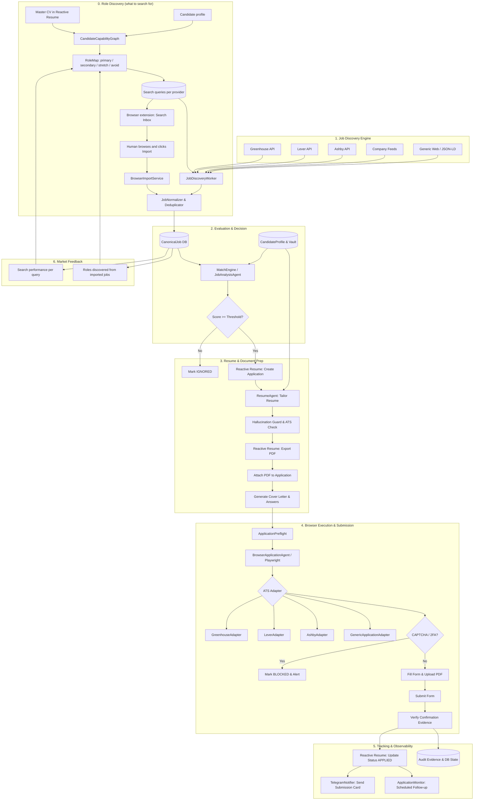

# Job Agent — System Architecture

## 1. High-Level Architecture Overview

Job Agent is a hybrid deterministic-agentic system designed for continuous, resilient job discovery, evaluation, resume tailoring, automated browser application, and application tracking.

There are two ways a job enters the system. The scheduled discovery engine sweeps
job boards on its own, and the human-in-the-loop loop described in
[ROLE_DISCOVERY.md](ROLE_DISCOVERY.md) lets the user import jobs they picked out
themselves from searches the RoleDiscoveryAgent recommended. Both converge on the
same normalizer, deduplicator and match engine.



---

## 2. Core Philosophy: LLM Reasoning vs Deterministic Engineering

A fundamental principle of Job Agent is strict separation of concerns:

| Domain | Responsibility | Handled By |
|---|---|---|
| **Semantic Understanding** | Parsing complex job requirements, assessing nuances of candidate experience, contextual bullet point prioritization, drafting natural responses, reasoning through unknown form fields. | **LLM (JobAnalysisAgent, ResumeAgent, BrowserAgent)** |
| **Integrity & Guardrails** | Preventing hallucination of non-existent employers, skills, dates, degrees, metrics, or credentials. | **Deterministic Code (HallucinationGuard, Profile Validator)** |
| **Form Interaction** | Locating form inputs via accessibility trees, selecting dropdowns, uploading files, waiting for DOM transitions. | **Deterministic Code (Playwright Locators & Adapters)** |
| **System Operations** | API calls, database transactions, idempotency locks, retries, rate limits, file I/O, Telegram transport, Celery queues. | **Deterministic Code (FastAPI, SQLAlchemy, Celery, httpx)** |

---

## 3. Directory Layout & Monorepo Structure

```text
JobAgent/
├── apps/
│   ├── api/                     # FastAPI backend (REST endpoints, webhooks)
│   │   ├── main.py
│   │   ├── routes/
│   │   │   ├── jobs.py
│   │   │   ├── applications.py
│   │   │   ├── answers.py
│   │   │   ├── system.py
│   │   │   └── webhooks.py
│   │   └── dependencies.py
│   ├── worker/                  # Celery application & task declarations
│   │   ├── celery_app.py
│   │   ├── tasks/
│   │   │   ├── discovery.py
│   │   │   ├── analysis.py
│   │   │   ├── tailoring.py
│   │   │   ├── browser.py
│   │   │   ├── monitor.py
│   │   │   └── telegram.py
│   │   └── beat_schedule.py
│   └── web/                     # React + TypeScript Vite frontend
│       ├── src/
│       │   ├── components/
│       │   ├── pages/
│       │   ├── services/
│       │   └── types/
│       ├── package.json
│       └── vite.config.ts
├── packages/
│   ├── domain/                  # Core domain models, enums, interfaces
│   │   ├── models.py
│   │   ├── enums.py
│   │   └── state_machine.py
│   ├── reactive_resume/         # Typed client for Reactive Resume v5 REST & MCP
│   │   ├── client.py
│   │   ├── models.py
│   │   └── patch_builder.py
│   ├── candidate_profile/       # Profile loader, AnswerVault & anti-hallucination guard
│   │   ├── profile.py
│   │   ├── answer_vault.py
│   │   └── guard.py
│   ├── job_sources/             # Extensible job discovery adapters
│   │   ├── base.py
│   │   ├── greenhouse.py
│   │   ├── lever.py
│   │   ├── ashby.py
│   │   ├── company_careers.py
│   │   └── feeds.py
│   ├── llm/                     # Multi-provider LLM abstraction
│   │   ├── base.py
│   │   ├── openai_provider.py
│   │   ├── anthropic_provider.py
│   │   ├── gemini_provider.py
│   │   └── gateway.py
│   ├── browser/                 # Playwright automation engine
│   │   ├── session.py
│   │   ├── locators.py
│   │   └── forms.py
│   ├── application_adapters/    # ATS-specific form handlers
│   │   ├── base.py
│   │   ├── greenhouse.py
│   │   ├── lever.py
│   │   ├── ashby.py
│   │   ├── workday.py
│   │   └── generic.py
│   ├── preflight/               # 12-point pre-submit verification
│   │   ├── checker.py
│   │   └── rules.py
│   ├── telegram/                # Telegram bot & interactive handlers
│   │   ├── bot.py
│   │   ├── notifications.py
│   │   └── handlers.py
│   └── persistence/             # PostgreSQL database layer
│       ├── database.py
│       ├── models.py
│       └── repositories.py
├── config/
│   ├── candidate-profile.yaml   # Master candidate configuration
│   └── settings.py              # Pydantic base settings
├── docker/
│   ├── Dockerfile.api
│   ├── Dockerfile.worker
│   ├── Dockerfile.web
│   └── docker-compose.yml
├── tests/
│   ├── unit/
│   ├── integration/
│   └── fixtures/
├── ARCHITECTURE.md
├── IMPLEMENTATION_PLAN.md
├── REACTIVE_RESUME_INTEGRATION.md
├── APPLICATION_STATE_MACHINE.md
└── SECURITY.md
```

---

## 4. Key Subsystem Interactions

### A. CandidateAnswerVault
- Form questions repeatedly ask for sponsorship, work authorization, notice periods, salary expectations, and technology tenure.
- The `CandidateAnswerVault` acts as an auditable, persistent memory store for normalized canonical questions.
- If a question cannot be resolved with high confidence (>= 0.95) from existing verified answers or deterministic profile attributes, the application enters `NEEDS_USER_INPUT` and alerts the user via Telegram with inline quick-reply buttons.

### B. Preflight & Idempotency Protection
- Before invoking the final `submit` action in Playwright, `ApplicationPreflight` runs synchronously.
- It computes a cryptographic fingerprint of `(company, role, applyUrl, candidate_email, date)`.
- If an active lock or completed application exists with this fingerprint, submission halts immediately to prevent double-applying.
- Full pre-submit DOM snapshots and screenshots are stored in `JobSnapshot` for complete post-incident auditability.

### C. Multi-Level Observability
- Every execution run receives a unique UUID `run_id`.
- Celery tasks propagate `correlation_id`, `job_id`, and `application_id` through structured JSON logs.
- Failures capture:
  - Error category (`NETWORK_ERROR`, `CAPTCHA`, `VALIDATION_ERROR`, etc.)
  - Full Playwright screenshot and DOM HTML
  - Request/response payloads
  - LLM input prompts and structured outputs
