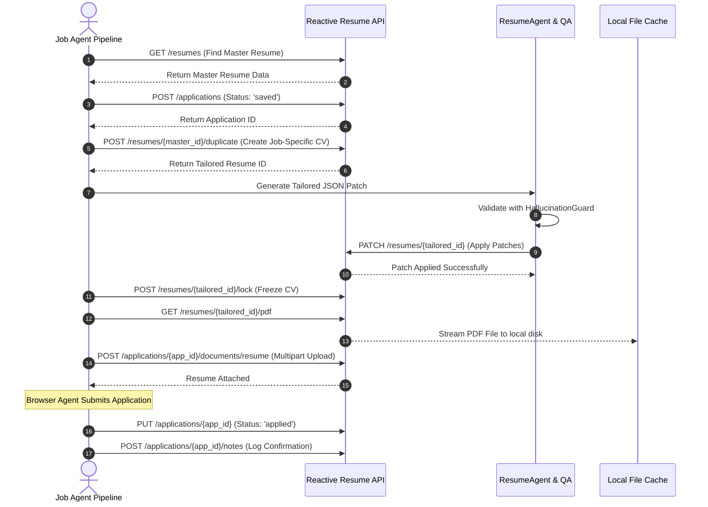

# Reactive Resume v5 Integration Architecture

## 1. Overview & Version Reference

Job Agent integrates deeply with **Reactive Resume v5.2.8+**, using it as:
1. **The Master CV Repository**: The single source of truth for the candidate's verified professional history.
2. **The Document Rendering Engine**: Generating high-fidelity, ATS-friendly PDF resumes and cover letters via Chrome/Puppeteer.
3. **The Application Tracker Pipeline**: Visualizing and tracking job applications across stages (`saved`, `applied`, `screening`, `interview`, `offer`, `rejected`).
4. **Document Storage**: Storing the exact PDF files submitted for each specific role.

### Base Configuration
- **API Base URL**: `https://rxresu.me/api/openapi` (or self-hosted `http://localhost:3000/api/openapi`)
- **Authentication**: Custom header `x-api-key: <REACTIVE_RESUME_API_KEY>`
- **MCP Endpoint**: `https://rxresu.me/mcp` (Streamable HTTP with `x-api-key`)

---

## 2. Capability Mapping: Reactive Resume vs Job Agent

| Functionality | Reactive Resume Native Endpoint | Job Agent Implementation | Reason for Responsibility |
|---|---|---|---|
| **Master CV Storage** | `GET /resumes/{id}` | Cache in memory & validate | Reactive Resume provides rich visual UI for candidate to maintain master CV |
| **Deriving Tailored CV** | `POST /resumes/{id}/duplicate` | Invokes duplicate with job-specific name & slug | Preserves master CV intact, keeps derived versions isolated |
| **Tailoring CV Content** | `PATCH /resumes/{id}` (RFC 6902) & `POST /applications/{id}/ai/tailor-resume` | `ResumeAgent` + JSON Patch Builder | Ensures strict adherence to `CandidateProfile` without hallucination |
| **PDF Generation** | `GET /resumes/{id}/pdf` | Downloads binary stream to local temp cache | Reuses Reactive Resume's high-quality headless browser rendering |
| **Application Tracking** | `GET /applications`, `POST /applications`, `PUT /applications/{id}` | Synchronizes stage and metadata | Unified visual pipeline for candidate |
| **Document Archiving** | `POST /applications/{id}/documents/{kind}` | Uploads generated PDF as `resume` or `cover-letter` | Permanent audit record of exact sent documents |
| **Timeline Activity** | `POST /applications/{id}/notes` | Logs discovery, match score, submission confirmation | Complete timeline visible in Reactive Resume UI |
| **Job Discovery & Crawling** | *None* | Job Agent `JobDiscoveryEngine` | Out of scope for resume builder |
| **Browser Automation** | *None* | Job Agent `BrowserApplicationAgent` (Playwright) | Out of scope for resume builder |
| **Telegram Notifications** | *None* | Job Agent `TelegramNotifier` | Out of scope for resume builder |
| **Question Answer Vault** | *None* | Job Agent `CandidateAnswerVault` | Domain-specific application memory |

---

## 3. Detailed Endpoint Contracts

### 3.1 Resumes API

#### List Resumes
- **Method**: `GET /resumes`
- **Headers**: `x-api-key: <KEY>`
- **Purpose**: Identify the master resume ID and verify existing derived resumes.

#### Get Resume by ID
- **Method**: `GET /resumes/{id}`
- **Headers**: `x-api-key: <KEY>`
- **Response**: Full `ResumeData` object (basics, work experience, education, skills, projects, custom sections).

#### Duplicate Resume
- **Method**: `POST /resumes/{id}/duplicate`
- **Request Body**:
  ```json
  {
    "name": "Bruno Moya — Apple — XR Software Engineer",
    "slug": "bruno-moya-apple-xr-software-engineer-2026",
    "tags": ["derived", "apple", "xr-engineer"]
  }
  ```
- **Response**: Duplicated resume object with new `id`.

#### Patch Resume (RFC 6902)
- **Method**: `PATCH /resumes/{id}`
- **Request Body**:
  ```json
  {
    "operations": [
      {
        "op": "replace",
        "path": "/data/basics/headline",
        "value": "Staff XR Engineer & Spatial Computing Architect"
      },
      {
        "op": "replace",
        "path": "/data/sections/summary/content",
        "value": "<p>10+ years specializing in Unity XR, computer vision...</p>"
      }
    ]
  }
  ```

#### Download Resume PDF
- **Method**: `GET /resumes/{id}/pdf?target=resume`
- **Response**: `application/pdf` binary stream.
- **Job Agent Usage**: Streams binary content directly to temporary disk cache, verified against empty byte size.

#### Lock Resume
- **Method**: `POST /resumes/{id}/lock`
- **Purpose**: Locks the tailored resume after final PDF generation to prevent accidental modifications.

---

### 3.2 Applications API

#### Create Application
- **Method**: `POST /applications`
- **Request Body**:
  ```json
  {
    "company": "Apple",
    "role": "XR Software Engineer",
    "location": "Barcelona / Remote",
    "salary": "€110,000 - €130,000",
    "source": "Greenhouse",
    "sourceUrl": "https://boards.greenhouse.io/apple/jobs/12345",
    "jobDescription": "We are looking for an experienced XR Engineer...",
    "resumeId": "<tailored_resume_id>",
    "tags": ["xr", "remote", "high-match"],
    "status": "saved",
    "followUpAt": "2026-09-23T10:00:00Z",
    "notes": "Discovered via Greenhouse feed. Match Score: 91/100."
  }
  ```
- **Response**: Created application record containing `id`.

#### Update Application Stage
- **Method**: `PUT /applications/{id}`
- **Request Body**:
  ```json
  {
    "status": "applied",
    "stageEnteredAt": "2026-09-09"
  }
  ```
- **Valid Status Values**: `saved` | `applied` | `screening` | `interview` | `offer` | `rejected`

#### Attach Document to Application
- **Method**: `POST /applications/{id}/documents/{kind}`
- **Path Parameter**: `kind` = `resume` | `cover-letter`
- **Content-Type**: `multipart/form-data`
- **Form Field**: `file: <binary PDF>`
- **Response**: Updated document metadata confirming attachment.

#### Log Activity Note
- **Method**: `POST /applications/{id}/notes`
- **Request Body**:
  ```json
  {
    "note": "Application submitted via Playwright. Confirmation received: #APP-98214."
  }
  ```

---

### 3.3 Application AI & Copilot Endpoints

Reactive Resume exposes built-in Copilot endpoints that can be leveraged or augmented:

- `POST /applications/ai/autofill`: Extracts company, role, location, salary from raw job description text.
- `POST /applications/{id}/ai/match-score`: Computes built-in Reactive Resume match score, strengths, and gaps.
- `POST /applications/{id}/ai/tailor-resume`: Derives a tailored copy of the linked resume.
- `POST /applications/{id}/ai/draft-message`: Drafts a cover letter or follow-up note (`kind: 'cover-letter' | 'follow-up'`).

*Note: Job Agent uses Reactive Resume's AI endpoints when available, but always verifies outputs through the local `HallucinationGuard` before applying them.*

---

## 4. End-to-End Reactive Resume Lifecycle in Job Agent



---

## 5. Error Handling & Resilience Strategy

1. **Authentication Failures (401 / 403)**:
   - Checked at system startup via `GET /resumes/tags`. If invalid, worker halts with critical log and alerts admin.
2. **PDF Generation Timeout**:
   - PDF rendering in Reactive Resume invokes a headless browser. Calls have a 60-second timeout with exponential backoff (2 retries).
3. **Locked Resume Conflicts**:
   - If attempting to patch a locked resume, Job Agent logs a warning, un-locks via `POST /resumes/{id}/lock` only if it is an agent-created derived resume, never if it is marked `master`.
4. **Idempotent Document Attachment**:
   - If an application already has a document attached of that `kind`, it is removed via `DELETE /applications/{id}/documents/{kind}` prior to attaching the updated version.
